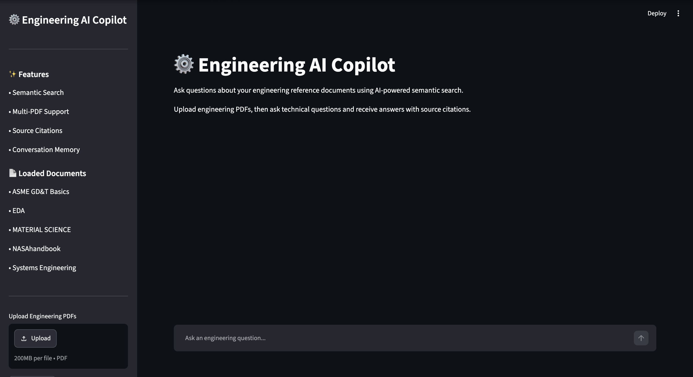
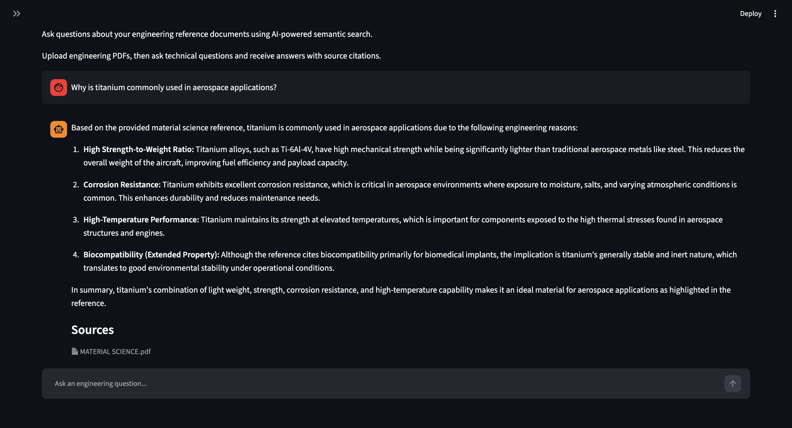
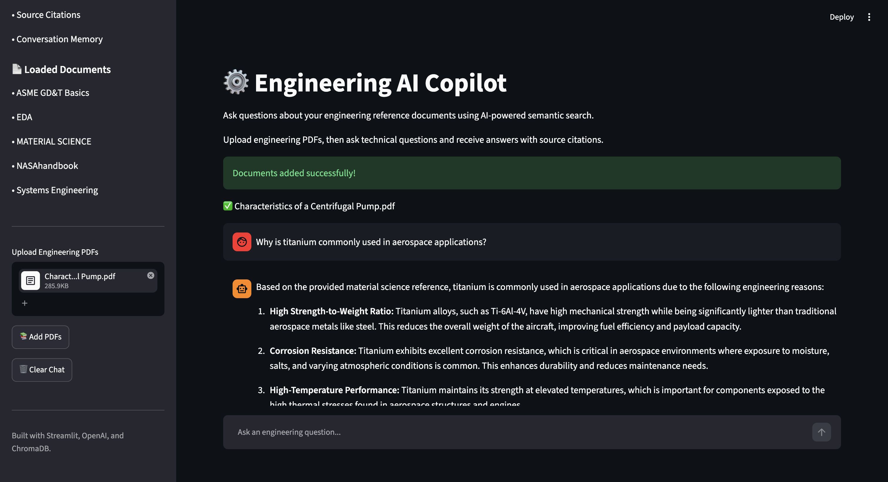
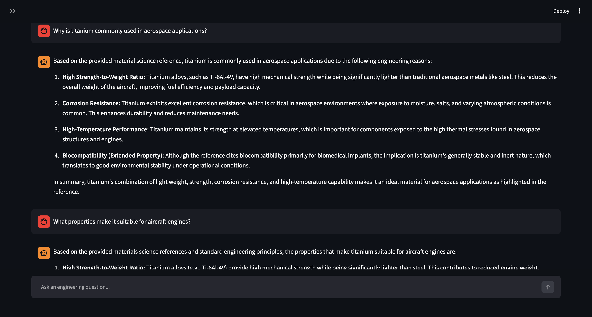

# ⚙️ Engineering AI Copilot


## Demo


> **Built with Python, Streamlit, OpenAI, and ChromaDB to demonstrate Retrieval-Augmented Generation (RAG) for engineering document search and question answering.**

Engineering AI Copilot is a Retrieval-Augmented Generation (RAG) application that enables users to ask natural-language questions about engineering reference documents through a conversational interface.

Uploaded engineering PDFs are indexed using semantic vector embeddings and stored in a ChromaDB vector database. When a question is asked, the application retrieves the most relevant document passages and provides a grounded response with source citations.

This project explores how Retrieval-Augmented Generation (RAG) can improve the accuracy and traceability of answers generated from engineering reference documents.

## User Interface



---

## Features

- Upload one or multiple engineering PDF documents
- Extract and index document text automatically
- Perform semantic search using OpenAI embeddings
- Generate answers using retrieved document context
- Display source documents for every response
- Support multi-turn conversations with chat history
- Incrementally add new documents without rebuilding the entire database
- Interactive web interface built with Streamlit

## Example Conversation


*Example response generated from retrieved engineering documents with source citations.*

---

## Architecture

```text
            Engineering PDF Documents
                        │
                        ▼
            PDF Text Extraction (PyPDF)
                        │
                        ▼
            Document Chunking
                        │
                        ▼
            Embedding Generation
            (text-embedding-3-small)
                        │
                        ▼
            ChromaDB Vector Database
                        │
                        ▼
            Semantic Similarity Search
                        │
                        ▼
            Retrieved Context
                        │
                        ▼
                GPT-4.1-mini
                        │
                        ▼
                Grounded Response
                + Source Citations
```

## How It Works

1. **Document Ingestion**
   - Engineering PDF documents are uploaded through the Streamlit interface.
   - Text is extracted from each document using PyPDF.

2. **Chunking**
   - Extracted text is divided into overlapping chunks to preserve context while improving retrieval accuracy.

3. **Embedding Generation**
   - Each chunk is converted into a vector embedding using OpenAI's `text-embedding-3-small` model.
   - The embeddings are stored in a ChromaDB vector database.

4. **Semantic Retrieval**
   - When a user submits a question, the query is embedded using the same embedding model.
   - ChromaDB performs a similarity search and returns the most relevant document chunks.

5. **Response Generation**
   - The retrieved document context, along with recent conversation history, is provided to GPT-4.1-mini.
   - The model generates an answer using the retrieved engineering references and includes the corresponding source documents.

## Technology Stack

| Category | Technology |
|-----------|------------|
| Language | Python |
| User Interface | Streamlit |
| Large Language Model | OpenAI GPT-4.1-mini |
| Embeddings | OpenAI text-embedding-3-small |
| Vector Database | ChromaDB |
| PDF Processing | PyPDF |
| Environment Variables | python-dotenv |

## Key Concepts

This project demonstrates several techniques commonly used in modern AI applications:

- **Retrieval-Augmented Generation (RAG)** for grounded responses
- **Semantic search** using vector embeddings instead of keyword matching
- **Vector databases** for efficient similarity search
- **Prompt engineering** to combine retrieved context with user questions
- **Conversation memory** for multi-turn interactions

## Installation

Clone the repository:

```bash
git clone https://github.com/<your-username>/engineering-ai-copilot.git
cd engineering-ai-copilot
```

Create and activate a virtual environment:

```bash
python -m venv .venv
```

macOS / Linux

```bash
source .venv/bin/activate
```

Windows

```bash
.venv\Scripts\activate
```

Install the required packages:

```bash
pip install -r requirements.txt
```

Create a `.env` file from `.env.example` and add your OpenAI API key:

```text
OPENAI_API_KEY=your_api_key_here
```

## Running the Application

Start the Streamlit application:

```bash
python -m streamlit run app/app.py
```

The application will open in your browser, where engineering PDFs can be uploaded and queried through the chat interface.

## Uploading Documents



## Example Questions

After uploading engineering reference documents, try questions such as:

- Why is titanium commonly used in aerospace applications?
- Explain Young's modulus.
- Compare polymers and ceramics.
- What is the rule of mixtures for composite materials?
- How does crystal structure influence material properties?
- What is a datum in GD&T?

## Project Structure

```
engineering-ai-copilot/
│
├── app/                 # Streamlit application
├── data/                # Uploaded documents and vector database
├── src/                 # Core RAG pipeline
├── tests/               # Testing utilities
│
├── README.md
├── requirements.txt
├── .env.example
└── .gitignore
```

## Conversational Context

The application maintains short-term conversation history so follow-up questions can reference earlier responses without repeating context.



## Future Improvements

Potential areas for future development include:

- Display page-level citations for retrieved document passages
- Support additional document formats (Word, HTML, Markdown)
- Integrate retrieval reranking to improve search relevance
- Deploy the application with persistent cloud storage
- Add user accounts and document collections

## License

This project is available under the MIT License.